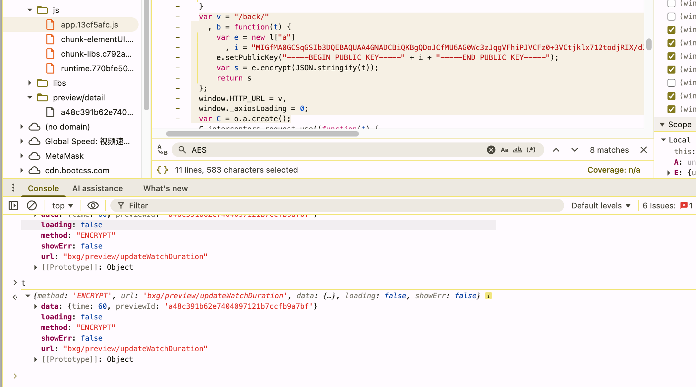
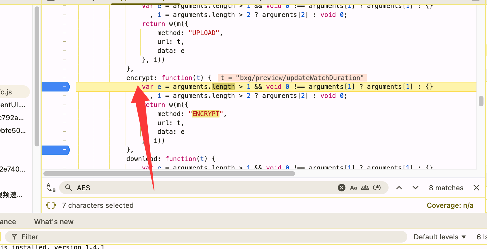
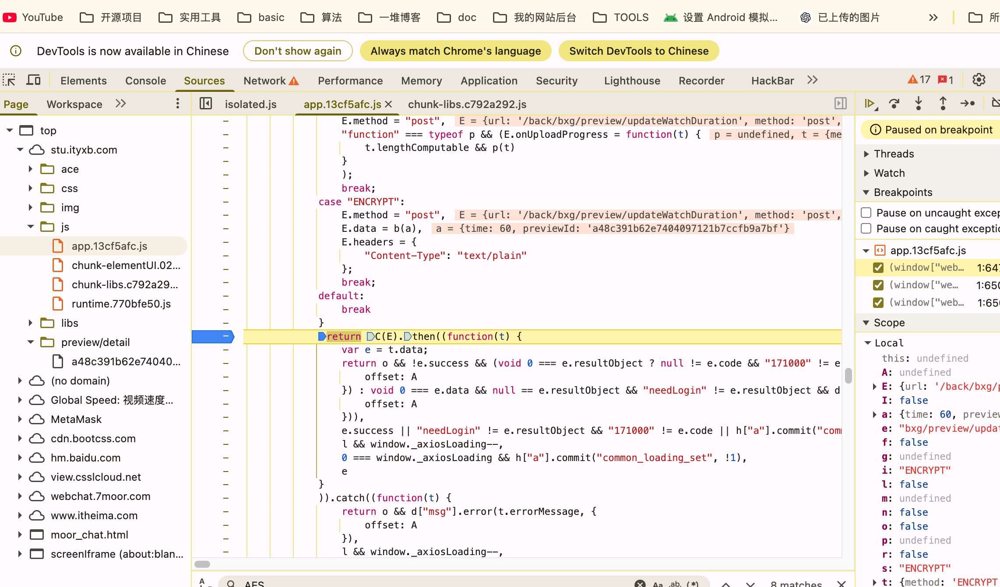
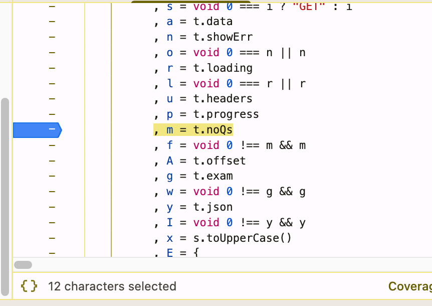

# 传智播客高校学习平台 · 预习视频自动刷课

用 `requests + Session` 自动刷完 [stu.ityxb.com](https://stu.ityxb.com)（传智高校学习平台）的「我的预习」视频，全程纯 API、无需浏览器/Selenium。支持全局速度控制、断点续刷、多课程遍历。

> ⚠️ 仅用于个人学习自动化。使用前请知悉平台用户协议，风险自负。

---

## 功能

- `requests + Session` 维持登录态，纯接口刷课
- 全局速度参数 `--speed`，服务端对进度跳跃宽松，可高速刷完
- 自动遍历：课程 → 预习 → 小节（point）→ 100%
- 断点续刷（从 `watched_duration` 接着刷）
- 失败自动重试、跳过已完成、可选 RSA 加密心跳
- 两个入口：`main.py`（优化版，推荐）/ `test.py`（原版）

---

## 核心架构（逆向结论，最重要）

平台有**两个名字很像、作用完全不同**的接口，搞混就刷不动：

| 接口 | 方法 | 参数 | 作用 |
|---|---|---|---|
| `bxg/preview/updateProgress` | **普通 POST（form 表单，不加密）** | `{previewId, pointId, watchedDuration}` | **真正推进单节进度** ← 核心 |
| `bxg/preview/updateWatchDuration` | RSA-1024/PKCS#1-v1.5 加密 POST | `{time, previewId}` | 观看心跳，**不推进进度** |

- **`updateProgress` 才是刷进度的**。服务端直接接收 `watchedDuration` 值（绝对秒数），对大幅跳跃很宽松（实测一次 +100~+300s 照单全收），所以可以大步长快速刷完。
- `updateWatchDuration` 是 RSA 加密的观看心跳，仅记录累计观看时长，**不会**改变任何小节的 `progress100`。它名字太像进度接口，极易误用——本项目早期就踩了这个坑，对着心跳接口发了半天 `参数错误`。
- RSA 公钥（1024 位）硬编码在平台前端 `app.13cf5afc.js` 的 http 封装模块 `830b` 里；心跳用 `JSEncrypt` 的 PKCS#1 v1.5 加密 `JSON.stringify({time, previewId})`，输出 base64。**公钥加密单向，无需私钥**即可生成合法心跳。
- 平台反作弊：进度必须单调递增（`watched_duration >= t` 则不报），脚本发送严格递增的 `watchedDuration`。

> 刷进度只需 `updateProgress`（明文）；RSA 心跳是可选项（模拟真实观看、降低风控概率），默认关闭。

---

## 接口流程

| 步骤 | 接口 | 方法 | 作用 |
|---|---|---|---|
| 1 | `bxg/course/getHaveList` | POST (form) | 我的所有课程 |
| 2 | `bxg/preview/list?courseId=` | GET | 某课程下的所有预习 |
| 3 | `bxg/preview/info?previewId=` | GET | 预习详情：`chapters[].points[]`（每个 point 有 `video_duration` / `watched_duration` / `progress100` / `point_id`）|
| 4 | `bxg/preview/updateProgress` | POST (form) | **上报单节进度（核心）** |
| ☆ | `bxg/preview/updateWatchDuration` | POST (RSA) | 可选心跳 |

---

## 安装

```bash
pip install -r requirements.txt
```

依赖：`requests`（HTTP）、`pycryptodome`（仅 RSA 心跳用；只刷进度其实不需要，但默认装上无害）。

---

## 配置 Cookie（必读）

平台鉴权靠 Cookie 里的会话令牌 `ityxb_sss`，它是 **HttpOnly** 的。

> ⚠️ **不要用 `document.cookie`** —— JS 读不到 HttpOnly Cookie，必然漏掉 `ityxb_sss`，服务端返回「请登录」。**Cookie 必须包含 `ityxb_sss`。**

**正确取法（用 EditThisCookie 插件）：**

1. 浏览器登录 [stu.ityxb.com](https://stu.ityxb.com)，打开任一学习页
2. 点 EditThisCookie 图标 → **Export**（导出），得到分号分隔的整串（含 `ityxb_sss`）
3. 存到项目根目录的 `cookie.tnt` 文件里（`main.py` 自动读取）

脚本加载顺序（优先级从高到低）：`--cookie` 命令行直传 > `--ask` 强制交互 > `cookie.tnt` 文件 > 运行时交互兜底（详见下文「Cookie 提供方式」）。

> 同样可用：F12 → Application → Cookies → stu.ityxb.com，或 Network → 任一请求的 `Cookie:` 请求头（这两个都能看到 HttpOnly）。

---

## 使用

```bash
# 全量刷（所有课程的所有预习），每次推进 100s
python3 main.py

# 提速：每次 +300s
python3 main.py --speed 300

# 只刷单个预习
python3 main.py --preview-id a48c391b62e7404097121b7ccfb9a7bf

# 指定课程（可多次）
python3 main.py --course-id 5d55f44711c44173b86a4f599ecef2fb

# 只列出课程/预习，不刷
python3 main.py --list-only

# 不跳过已完成的小节，重刷
python3 main.py --redo

# 命令行直接传 Cookie（优先于 cookie.tnt，免建文件）
python3 main.py --cookie "ityxb_sss=9ADB...; _uc_t_=...; uuid_...=..."

# 强制交互输入 Cookie（忽略 cookie.tnt）
python3 main.py --ask
```

### 参数

| 参数 | 说明 | 默认 |
|---|---|---|
| `--speed` | 每次 `updateProgress` 推进的秒数（越大越快）| `100` |
| `--interval` | 两次上报之间的真实间隔秒数 | `1.5` |
| `--preview-id` | 只刷单个预习 | 空 |
| `--course-id` | 指定 courseId，可多次传 | 空 = 全部 |
| `--list-only` | 仅列出，不刷 | `False` |
| `--redo` | 不跳过已完成小节 | `False` |
| `--cookie` | 直接传 Cookie 字符串（优先于文件/交互）| 空 |
| `--ask` | 强制交互输入 Cookie（忽略 cookie.tnt）| `False` |

### Cookie 提供方式（优先级从高到低）

1. `--cookie "..."` —— 命令行直接传
2. `--ask` —— 强制交互输入 `Cookie>` 提示符
3. `cookie.tnt` 文件 —— 自动读取（缺 `ityxb_sss` 会提示）
4. 交互兜底 —— 上面都没有时自动弹输入

---

## 速度说明

- **`--speed N`** = 每次 `updateProgress` 让进度推进 N 秒。
- 服务端对 `watchedDuration` 的大跳跃非常宽松（实测 +100、+300 一次都接受），可以放心开大。
- 一段 1000s 的视频，`--speed 200 --interval 1`：≈ 5 次上报 × 1s ≈ 5 秒刷完。
- `--interval` 别设太小（<1s）以免触发频率风控；1~2s 比较稳。

---

## 项目结构

```
传智播客/
├── main.py          # 优化版（推荐）：核心 updateProgress + 可选 RSA 心跳 + 重试/续刷
├── test.py          # 原版（保留，功能等价）
├── cookie.tnt       # 你的 Cookie（EditThisCookie 导出，含 ityxb_sss）
├── requirements.txt # requests、pycryptodome
└── README.md        # 本文档
```

`main.py` 分块：

1. **配置** — Cookie 文件 / 速度 / 间隔 / 心跳开关
2. **RSA 加密** — `rsa_encrypt()`（仅心跳，复刻平台 `830b` 模块 `b()`）
3. **Cookie/Session** — `load_cookie()` / `resolve_login_name()`（手机号自动从 `_uc_t_` 解析）/ `build_session()`
4. **API** — `get_courses` / `get_previews` / `get_points` / `update_progress`（核心）/ `send_heartbeat`
5. **刷课逻辑** — `watch_point`（递增上报 + 重试）/ `watch_preview` / `main`

---

## 排查

| 现象 | 原因 / 处理 |
|---|---|
| `请登录` / `needLogin` | Cookie 缺 `ityxb_sss`（HttpOnly）。改用 EditThisCookie 导出，别用 `document.cookie` |
| `参数错误`（updateProgress）| ① Cookie 失效 ② `pointId` 取错（应为 `point_id`）③ `previewId` 没传对 |
| 上报 `success:true` 但进度没涨 | 你发到了 `updateWatchDuration`（心跳），那是心跳不推进进度；要用 **`updateProgress`** |
| 进度刷了又被打回 | 极少；可开 `HEARTBEAT=True` 同时发心跳模拟真实观看 |
| `获取课程失败` | Cookie 整体失效，重新导出 `cookie.tnt` |

---

## 逆向参考

- 平台前端：`https://stu.ityxb.com/js/app.13cf5afc.js`
- http 封装模块 `830b`：`b()`（RSA 加密）、`w()`（请求分发，`ENCRYPT` 走加密心跳、`POST` 走明文）
- 预习 API 模块 `94b3`：`n = post("bxg/preview/updateProgress")`（进度）、`l = encrypt("bxg/preview/updateWatchDuration")`（心跳）
- 预习详情组件 `3e5b`：`updateProgress()` 反作弊（进度单调递增）

---

## 逆向过程（图解）

以下截图记录了整个逆向调试过程，按排查顺序排列。

### 1. 定位加密入口 —— 全局搜 `updateWatchDuration` / `encrypt`

在 `app.13cf5afc.js` 里搜到 `updateWatchDuration`（更新观看时长）和 `encrypt`（加密）函数，确认请求体经过了加密处理。左侧文件列表可见前端 bundle 结构。



### 2. 分析 `encrypt()` 函数 —— 曾误判为 AES

`encrypt(t)` 内部调用 `w/m({method:"ENCRYPT", url:t, data:e})`。当时底部搜索框查 `AES`（8 处匹配），一度以为加密算法是 AES——后来回放抓包 + 手写 PKCS 才确认其实是 **RSA-1024 / PKCS#1 v1.5**（密文恒 128 字节是 RSA 单块特征）。



### 3. 断点调试 `updateWatchDuration` 接口调用

在 `previewdetail.js` 下断点，命中 `updateWatchDuration` 接口调用：`Content-Type: text/plain`，请求体是加密后的 base64。右侧 Scope 面板可观察变量。**关键发现**：这个接口的明文是 `{time, previewId}`（心跳），**不是**推进进度的接口。



### 4. 进入 `w()` 分发函数 —— 区分加密心跳 vs 明文进度（转折点）

在 http 封装模块 `830b` 的 `w()` 函数里断点，观察变量解构（`a = t.data`、`m = t.noQs` 等）。`switch(method)` 分支确认：`ENCRYPT` → 走 RSA 加密（心跳），`POST` → 走明文 form 表单。由此定位到真正推进进度的接口是 `bxg/preview/updateProgress`（普通 POST），而非加密的 `updateWatchDuration`。



> 整个逆向的关键转折在第 4 步：把「加密的 updateWatchDuration（心跳）」和「明文的 updateProgress（进度）」区分开，之前所有 `参数错误` 都是因为把心跳接口当成了进度接口。
